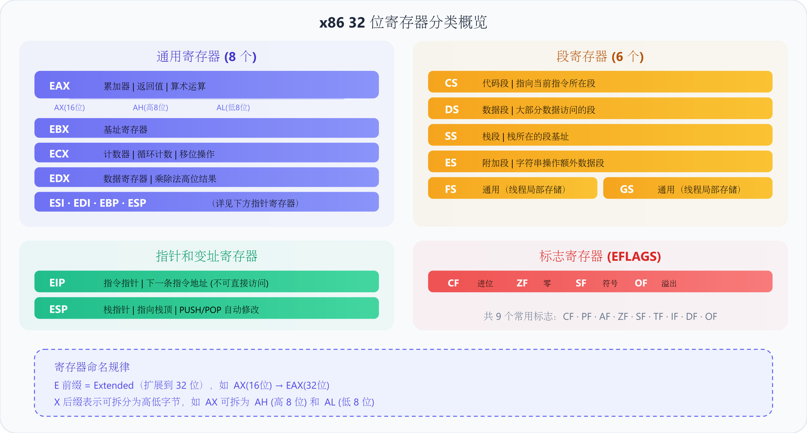
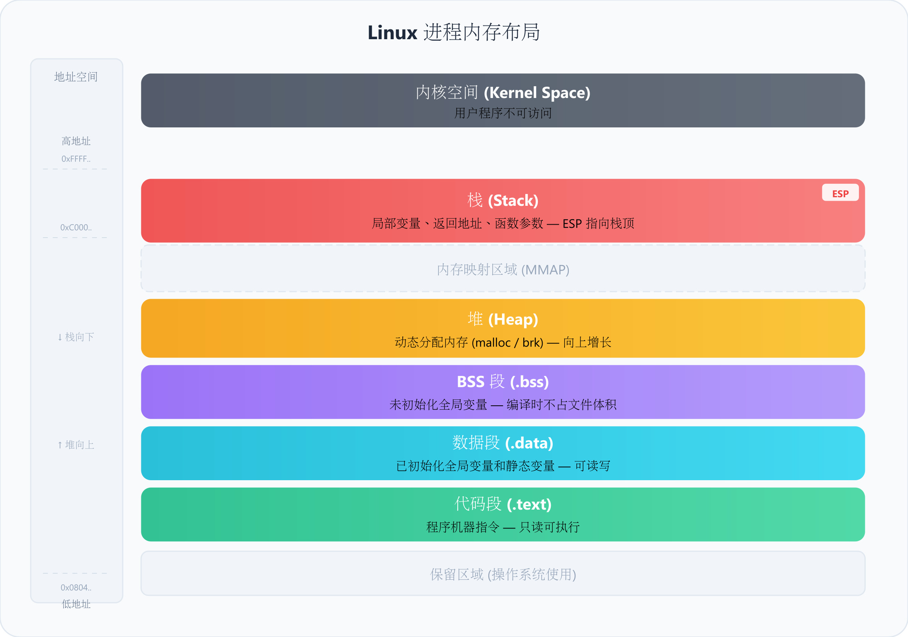

# Assembly

`[标签:]   指令助记符   [操作数]   [; 注释]`


*汇编代码中注释极其重要。*

---

### register



---

### insn

*4 路循环展开，是经典的分支优化手段。*

| 指令 | 功能                                 |
| :--- | :----------------------------------- |
| MOV  | 数据传送                             |
| LEA  | 取地址                               |
| CALL | 函数调用（`push eip` + `jmp label`） |
| RET  | 函数返回（`pop eip`）                |
| DB   | 定义变量（`.data`）                  |
| RESB | 预留空间（`.bss`）                   |
| EQU  | 等值常量                             |

> ***BYTE(1) WORD(2) DWORD(4) QWORD(8) OWORD(16)***

---

### call

*函数序言和尾声是标准的栈帧管理模板。*


---

### memory




> e.g. for memory allo

```assembly
; 文件路径：mmap_demo.asm
; 使用 mmap 分配可独立释放的内存

section .data
    ; mmap 相关常量
    PROT_READ equ 1
    PROT_WRITE equ 2
    MAP_PRIVATE equ 2
    MAP_ANONYMOUS equ 0x20

section .bss
    mem_block resd 1             ; 保存分配的内存地址

section .text
    global _start

_start:
    ; mmap 调用：分配 4096 字节的匿名内存
    mov eax, 192                 ; sys_mmap2
    mov ebx, 0                   ; 让内核选择地址
    mov ecx, 4096                ; 分配大小：4KB
    mov edx, PROT_READ | PROT_WRITE  ; 可读可写
    mov esi, MAP_PRIVATE | MAP_ANONYMOUS  ; 私有匿名映射
    mov edi, -1                  ; 文件描述符（匿名映射用 -1）
    mov ebp, 0                   ; 偏移量（匿名映射用 0）
    int 0x80
    ; EAX = 分配的内存地址（失败返回负值）

    cmp eax, -4096               ; 检查是否失败
    ja  mmap_failed              ; 如果在 -4095 ~ -1 之间，失败

    mov [mem_block], eax         ; 保存内存地址

    ; 使用分配的内存：写入数据
    mov ebx, [mem_block]
    mov dword [ebx], 0x12345678  ; 写入 4 字节
    mov dword [ebx + 4], 'runo'  ; 写入 "runo"
    mov dword [ebx + 8], 'ob!!'  ; 写入 "ob!!"

    ; 释放内存：munmap
    mov eax, 91                  ; sys_munmap
    mov ebx, [mem_block]         ; 内存地址
    mov ecx, 4096                ; 释放大小
    int 0x80

    jmp exit

mmap_failed:
    ; 处理错误...

exit:
    mov eax, 1
    mov ebx, 0
    int 0x80
```

